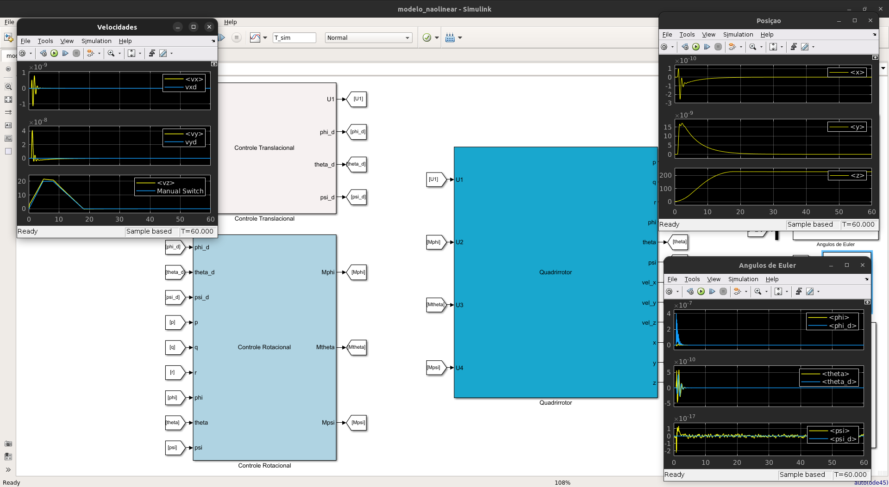

# Modelagem e Controle nãolinear do Quadrirrotor em Matlab-Simulink
Matlab 9.4.0.813654 (R2018a)



## Modelo não linear 1
O modelo Simulink `UAV_naolinear.slx` e o arquivo `modelo_naolinear_params.m` representam a modelagem de um veículo aéreo não tripulado tipo VANT quadrirrotor.

O modelo implementado é o seguinte:
```math
\begin{align}
    \begin{split}
		\dot{\bm{\xi}}&=\bm{v}\\
		\dot{\bm{v}}&= -[0~0~{g}]^T+(1/m){\mathbf{R}}_B^I[0~0~{T}_b]^T\\
		\dot{\bm{\omega}}&=\bm{I}^{-1}\left(\bm{M}-\bm{\omega}\times{\bm{I}}\bm{\omega}\right)\\
		\dot{\bm{\eta}}&=\bm{\mathcal{W}}{\bm{\omega}}
    \end{split}    
\end{align}   
```
onde $\bm{\xi}=(x,y,z)$ representa a posição do veículo no referencial inercial e $\bm{v}=(v_x,v_y,v_z)$ representa a velocidade translacional. O vetor $\bm{\omega}=(p,q,r)$ é a velocidade angular e $\bm{\eta}=(\phi, \theta, \psi)$ são os ângulos de Euler.

